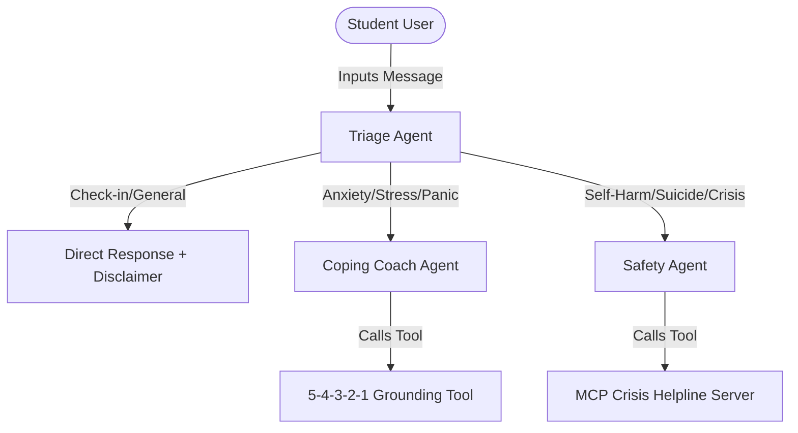

# 🧠 Manayush - Digital Mental Health Support for Students


<p align="center">
  <strong>An AI First-Aid & Psychological Support Fleet built for Campus Communities</strong>
  <br />
  <em>Submitted to the Kaggle & Google 5-Day AI Agents Intensive Course Capstone (Agents for Good Track)</em>
</p>

<p align="center">
  <a href="https://google-xkaggle-hackathon.vercel.app"></a>
  <a href="#-architecture"></a>
  <a href="https://github.com/ArshilTech/googleXkaggle-hackathon"></a>
</p>

---

## 📖 Table of Contents
1. [🌟 Project Overview & Pitch](#-project-overview--pitch)
2. [🤖 Agent Architecture](#-agent-architecture)
3. [🚀 Demonstration of Key Course Concepts](#-demonstration-of-key-course-concepts)
4. [🛠️ Technical Deep-Dive](#-technical-deep-dive)
5. [📋 Setup & Deployment Instructions](#-setup--deployment-instructions)
6. [🎓 About the Course](#-about-the-course)

---

## 🌟 Project Overview & Pitch

### The Problem
Higher education environments are highly stressful. Academic pressure, exam stress, isolation, and relationship challenges often impact students' mental health. On-campus psychological resources (like counsellors) are often overwhelmed, leaving students without immediate support during late-night panic attacks or acute stress episodes.

### Our Solution
**Manayush** is a stigma-free, student-first digital psychological aid. Using the **Google Agent Development Kit (ADK)**, we built a secure, production-ready multi-agent fleet that acts as an **AI First-Aid Companion**. It triages the student's emotional state, guides them through clinical grounding exercises, and routes them to emergency numbers when self-harm or crisis patterns are detected.



---

## 🤖 Agent Architecture

Manayush uses a hierarchical three-tier multi-agent system:

### 1. **Triage Agent (The Orchestrator)**
* **Role**: Analyzes the student's input mood and routes it to the appropriate specialist.
* **Instruction Strategy**: If the user shows symptoms of panic, stress, or exam anxiety, it delegates to `coping_coach_agent`. If the user shows crisis signals or mentions self-harm, it immediately delegates to `safety_agent`.

### 2. **Coping Coach Agent (Stress Regulator)**
* **Role**: Focuses on evidence-based emotional regulation.
* **Associated Tool**: `grounding_exercise_54321` tool.
* **Behavior**: Validates student stress with high empathy and walks them step-by-step through a sensory cooldown.

### 3. **Safety Agent (Crisis Guard)**
* **Role**: Ensures absolute student safety and legal compliance.
* **Associated Tool**: `get_crisis_helplines` (Mock MCP tool).
* **Behavior**: Intercepts emergency prompts, returns toll-free helpline numbers (like India's **Tele MANAS 14416**), and attaches a strict medical disclaimer.

---

## 🚀 Demonstration of Key Course Concepts

In compliance with the Capstone Project evaluation, Manayush integrates the following key concepts:

| Key Concept | Implementation Details | Location in Code |
| :--- | :--- | :--- |
| **Agent / Multi-Agent System** | Hierarchical routing using ADK's `LlmAgent` and `subAgents` configurations. | [api/chat.js (Line 185-271)](file:///e:/googleXkaggle-hackathon/api/chat.js#L185-L271) |
| **MCP Server Integration** | Simulates a Model Context Protocol tool `get_crisis_helplines` returning structured schema payloads. | [api/chat.js (Line 92-149)](file:///e:/googleXkaggle-hackathon/api/chat.js#L92-L149) |
| **Agent Skills** | `grounding_exercise_54321` parses a clinical grounding step list into the agent context dynamically. | [api/chat.js (Line 35-90)](file:///e:/googleXkaggle-hackathon/api/chat.js#L35-L90) |
| **Security Features** | Strict CORS configurations, message length limits, dynamic `.env` API guards, and automatic disclaimers. | [api/chat.js (Line 282-359)](file:///e:/googleXkaggle-hackathon/api/chat.js#L282-L359) |
| **Deployability** | Structured as a production-grade, stateless serverless handler designed for Vercel. | [api/chat.js (Line 296-435)](file:///e:/googleXkaggle-hackathon/api/chat.js#L296-L435) |

---

## 🛠️ Technical Deep-Dive

### Frontend Integration (`app.js`)
* **Typing Indicator**: Visually represents agent processing via CSS bouncing dot animations.
* **Resiliency Fallback**: If the serverless endpoint goes down or encounters an API key error, the client catches the failure and degrades gracefully to an offline keyword-matching assistant.
* **Session Persistence**: Maintains conversational session context (`chatSessionId`) across multiple turns.

### Safe Vercel Error Handling
If the LLM model throws an error (e.g. rate limits), the backend captures `event.errorCode`, aborts safely, and returns a `500` status with a `fallbackReply` structure. This ensures the frontend never displays raw stacks to the user.

---

## 📋 Setup & Deployment Instructions

### Local Development Setup
1. Clone the repository and install dependencies:
   ```bash
   git clone https://github.com/ArshilTech/googleXkaggle-hackathon.git
   cd googleXkaggle-hackathon
   npm install
   ```
2. Create a `.env` file in the root folder and add your Gemini API Key:
   ```env
   GEMINI_API_KEY=your_gemini_api_key_here
   ```
3. Run the development server:
   ```bash
   npx vercel dev
   ```
4. Open `http://localhost:3000` in your browser.

### Cloud Deployment to Vercel
Deploy your serverless workspace directly to production:
```bash
# Add your environment variable to Vercel securely
npx vercel env add GEMINI_API_KEY

# Push your deployment to production
npx vercel --prod
```

---

## 🎓 About the Course

**Intensive Vibe Coding Course with Google**
* **Day 1**: Transitioned from chat completion to fully autonomous agent loops.
* **Day 2**: Wired custom function tools and agent-to-agent delegator handshakes.
* **Day 3**: Explored agent skills, token limits, and stateful memory.
* **Day 4**: Implemented security controls, disclaimers, and rate-limiting fallbacks.
* **Day 5**: Moved agents to governed, observable production-grade serverless deployments.

---

<p align="center">
  Developed with 💚 for the student community.
</p>
